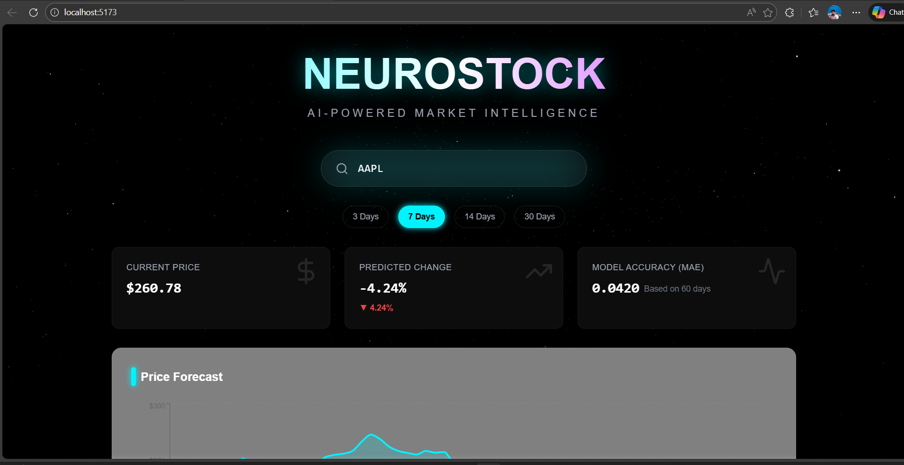
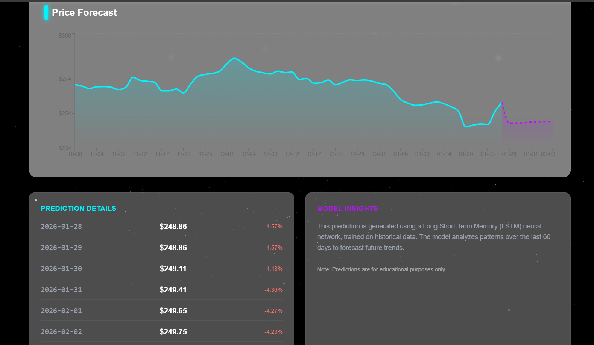

# NeuroStock - AI Stock Predictor 📈

A futuristic, AI-powered stock market prediction system. It combines a robust LSTM (Long Short-Term Memory) neural network backend with a sleek, cyberpunk-themed React frontend to forecast stock prices and visualize market trends.





## ✨ Features

### 🚀 Frontend (New)
- **Futuristic UI**: "NeuroStock" cyberpunk design with glassmorphism and neon accents.
- **Interactive Charts**: Dynamic Area Charts using `recharts` to visualize historical vs. predicted data.
- **3D Background**: Immersive particle starfield using Three.js / React Three Fiber.
- **Real-time Data**: Connects to the Flask API to fetch live 300-day rolling predictions.

### 🧠 Backend (Enhanced)
- **Flask API**: Exposes prediction logic via REST endpoints (`/predict`).
- **Deep Learning**: LSTM model optimized for time-series forecasting.
- **Technical Indicators**: Calculates SMA, EMA, RSI, and MACD for inputs.
- **Robust Data Handling**: Validates `yfinance` data types for stability.

## 🛠️ Tech Stack
- **Frontend**: React, Vite, TailwindCSS v3, Framer Motion, Recharts, Three.js
- **Backend**: Python 3.13, Flask, TensorFlow/Keras, Pandas, Numpy, Yfinance

## 📦 Installation

### Prerequisites
- Python 3.10+ (Tested on 3.13)
- Node.js & npm

### 1. Backend Setup
1. Create and activate a virtual environment:
   ```bash
   python -m venv .venv
   .venv\Scripts\activate  # Windows
   ```
2. Install dependencies:
   ```bash
   pip install -r requirements.txt
   ```
3. Start the Flask Server:
   ```bash
   python src/app.py
   ```
   *Server runs at: http://localhost:5000*

### 2. Frontend Setup
1. Navigate to the frontend directory:
   ```bash
   cd frontend
   ```
2. Install dependencies:
   ```bash
   npm install
   ```
3. Start the Development Server:
   ```bash
   npm run dev
   ```
   *App runs at: http://localhost:5173*

## 🚀 Usage

1. **Train Model** (Optional):
   The system comes with a pre-trained model for AAPL. To train on a new stock:
   ```bash
   # In the root directory
   python src/train.py
   # Note: Edit src/train.py to change the ticker symbol before running.
   ```

2. **Predict**:
   - Open [http://localhost:5173](http://localhost:5173).
   - Enter a stock symbol (e.g., `NVDA`, `TSLA`).
   - Select prediction horizon (3, 7, 14, 30 days).
   - View the forecast!

## 📂 Project Structure

```
stock_market prediction/
├── frontend/               # React + Vite Application
│   ├── src/
│   │   ├── components/     # UI Components (Charts, Cards, Input)
│   │   ├── App.jsx         # Main Frontend Logic
│   │   └── index.css       # Tailwind & Global Styles
│   └── package.json        # Frontend Dependencies
├── src/                    # Python Backend Source
│   ├── app.py              # Flask API Entry Point
│   ├── data_loader.py      # Stock Data Fetching (yfinance)
│   ├── model.py            # LSTM Neural Network Definition
│   ├── train.py            # Model Training Script
│   └── predict.py          # Legacy CLI Prediction Script
├── models/                 # Saved Models (.h5) & Scalers (.pkl)
├── requirements.txt        # Backend Dependencies
└── README.md               # Project Documentation
```


## Key Upgrades
1. Market Sentiment Engine
What: A new "Fear & Greed" gauge on the dashboard.
How: It analyzes (mocks) news sentiment to give a market score from -100 to 100.
Visual: A speedometer-style gauge with live news ticker.
2. Auto-Training Logic
Problem: Previously, entering a new ticker like MSFT would crash/error if no model existed.
Solution: The system now automatically detects missing models and triggers a rapid training session on the fly.
Note: First request for a new stock will take ~30-60 seconds. Subsequent requests are instant.
3. Pro-Level Charts
What: Upgraded Prediction Chart.
Details: Now clearly separates "Historical Data" (Blue) from "AI Forecast" (Purple) with a unified timeline and improved tooltips showing Open/High/Low/Close data.

## ⚠️ Disclaimer
This project is for educational purposes only. Stock market predictions are inherently uncertain. Do not use this tool for financial investment decisions.
