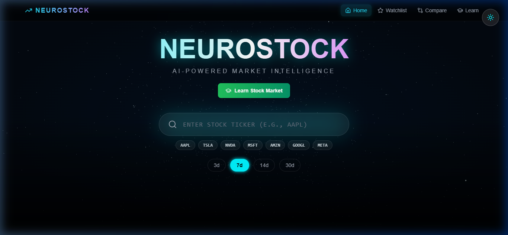
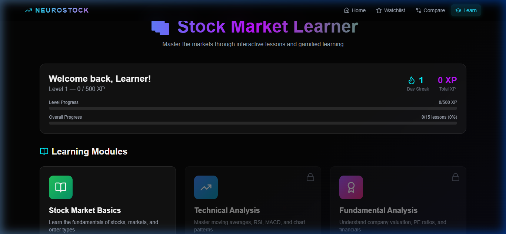

# NEUROSTOCK Full Upgrade — Walkthrough

## What Was Accomplished

All broken features have been fixed and new features have been added to the NEUROSTOCK stock market prediction platform.

---

## Screenshots


*Home page: NavBar with Home, Watchlist, Compare, Learn. Search bar with popular stock pills. Day selector (3d/7d/14d/30d).*


*Learner Dashboard: XP progress bars, Module 1 (Stock Market Basics) unlocked, Modules 2 & 3 locked.*

---

## 🎬 Browser Recording


---

## Changes Made

### Backend (`src/`)
| File | Change |
|------|--------|
| [app.py](file:///c:/Users/FARAZ%20KHAN/Desktop/DEKSTOP/PROJECTS/stock_market%20prediction/src/app.py) | Added `/stock-info` endpoint returning company name, sector, market cap, P/E, 52W high/low |
| [sentiment.py](file:///c:/Users/FARAZ%20KHAN/Desktop/DEKSTOP/PROJECTS/stock_market%20prediction/src/sentiment.py) | Now fetches **real news** from `yfinance` ticker, falls back to mock templates only if none found |

### Frontend Config
| File | Change |
|------|--------|
| [tailwind.config.js](file:///c:/Users/FARAZ%20KHAN/Desktop/DEKSTOP/PROJECTS/stock_market%20prediction/frontend/tailwind.config.js) | Added `dark-secondary` color, `marquee` animation + keyframe |

### Frontend Components
| File | Change |
|------|--------|
| [NavBar.jsx](file:///c:/Users/FARAZ%20KHAN/Desktop/DEKSTOP/PROJECTS/stock_market%20prediction/frontend/src/components/NavBar.jsx) | Added **Learn** nav link with GraduationCap icon; improved active route detection |
| [StockInput.jsx](file:///c:/Users/FARAZ%20KHAN/Desktop/DEKSTOP/PROJECTS/stock_market%20prediction/frontend/src/components/StockInput.jsx) | Added `externalTicker` prop so URL params / CommandPalette can set the visible ticker |
| [StockInfoCard.jsx](file:///c:/Users/FARAZ%20KHAN/Desktop/DEKSTOP/PROJECTS/stock_market%20prediction/frontend/src/components/StockInfoCard.jsx) | **NEW** — Company fundamentals card (name, sector, market cap, P/E, 52W range, dividend) |
| [App.jsx](file:///c:/Users/FARAZ%20KHAN/Desktop/DEKSTOP/PROJECTS/stock_market%20prediction/frontend/src/App.jsx) | URL param `?ticker=SYM` auto-triggers prediction; day-selector re-fetches if ticker loaded; StockInfoCard shown below stats cards; `/learner/simulator` route added |
| [WatchlistPage.jsx](file:///c:/Users/FARAZ%20KHAN/Desktop/DEKSTOP/PROJECTS/stock_market%20prediction/frontend/src/pages/WatchlistPage.jsx) | Zap ⚡ button now navigates to `/?ticker=SYM` triggering prediction via URL param |

### Learner Section
| File | Change |
|------|--------|
| [LearnerDashboard.jsx](file:///c:/Users/FARAZ%20KHAN/Desktop/DEKSTOP/PROJECTS/stock_market%20prediction/frontend/src/pages/Learner/LearnerDashboard.jsx) | localStorage persistence for XP/streak/progress; module unlock when quiz passed; all 3 modules shown |
| [LessonPage.jsx](file:///c:/Users/FARAZ%20KHAN/Desktop/DEKSTOP/PROJECTS/stock_market%20prediction/frontend/src/pages/Learner/LessonPage.jsx) | XP and `completedLessons` persisted to localStorage on "Mark Complete" |
| [QuizPage.jsx](file:///c:/Users/FARAZ%20KHAN/Desktop/DEKSTOP/PROJECTS/stock_market%20prediction/frontend/src/pages/Learner/QuizPage.jsx) | Module unlock + badge award persisted on quiz pass; `progressSaved` guard prevents double-saving |
| [VirtualTradingPage.jsx](file:///c:/Users/FARAZ%20KHAN/Desktop/DEKSTOP/PROJECTS/stock_market%20prediction/frontend/src/pages/Learner/VirtualTradingPage.jsx) | **NEW** — $10k virtual portfolio; search + buy/sell stocks; live P&L; localStorage persistence |

### Data
| File | Change |
|------|--------|
| [lessons.json](file:///c:/Users/FARAZ%20KHAN/Desktop/DEKSTOP/PROJECTS/stock_market%20prediction/frontend/src/data/lessons.json) | Added 5 Module 2 (Technical Analysis) lessons: Moving Averages, RSI, MACD, Bollinger Bands, Chart Patterns |
| [quizzes.json](file:///c:/Users/FARAZ%20KHAN/Desktop/DEKSTOP/PROJECTS/stock_market%20prediction/frontend/src/data/quizzes.json) | Added Module 2 quiz with 8 questions on technical analysis concepts |

---

## How to Run

**Backend:**
```bash
cd "c:\Users\FARAZ KHAN\Desktop\DEKSTOP\PROJECTS\stock_market prediction\src"
python app.py
```

**Frontend:**
```bash
cd "c:\Users\FARAZ KHAN\Desktop\DEKSTOP\PROJECTS\stock_market prediction\frontend"
npm run dev
```
Then open http://localhost:5173

---

## Bugs Fixed
- ✅ Market overview ticker bar now animated (marquee CSS was wired)
- ✅ Watchlist Zap ⚡ button now triggers prediction (via URL param `?ticker=SYM`)
- ✅ Day selector now re-fetches prediction when changed with ticker loaded
- ✅ `/learner/simulator` route was missing — now exists with full VirtualTradingPage
- ✅ Learner XP/progress now persists across page refreshes (localStorage)
- ✅ Modules 2 & 3 were permanently locked — now unlock on quiz completion
- ✅ CommandPalette search now syncs ticker into the search input (`externalTicker` prop)
- ✅ `dark-secondary` and `animate-marquee` Tailwind classes were undefined — now defined

## Verification
- **Build**: `npm run build` → exit code 0 (no errors) ✅
- **Frontend UI**: All pages load, nav works, learner section correct, virtual trading at correct route ✅
- **Backend data features**: Require backend to be running on port 5000
